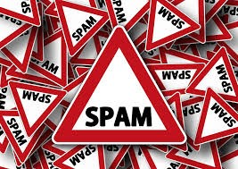

# Data Science Portfolio
---
## Machine learning

### Artificial Intelligence

# Project 1

Detection of spam and non spam mails

I have used Machine learning and NLP techniques in this projects . I have used 4 Algorithms in this that are Logistic Rregression, Decision Tree, Random Forest Classifer, Niave Bayes. Out of which  Random Forest  Classifier was giving the best result 
This is becuase it has Decision Tree

 
 
## Project 2

Bake A Wish 

 This uses Asp.net techniques for getting all the bakery shops onto asingle portal
 

